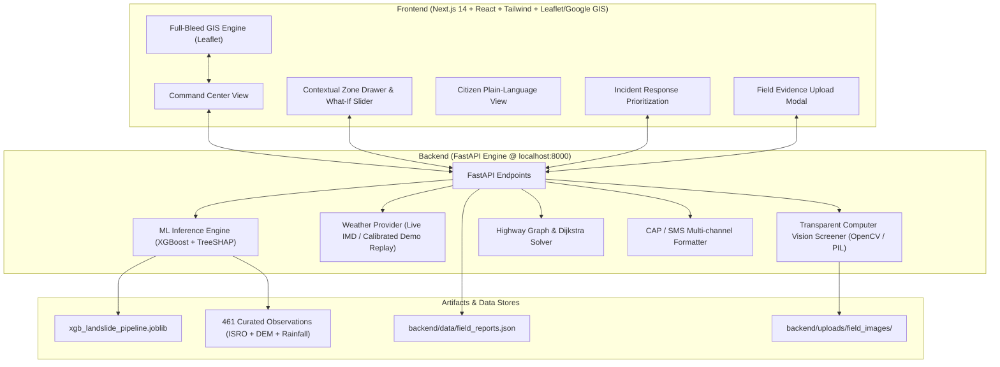

# PRAVAAH (प्रवाह) — Landslide Intelligence & Disaster Response Platform

[](https://nextjs.org)
[](https://fastapi.tiangolo.com)
[](https://xgboost.readthedocs.io)
[](#machine-learning-architecture)
[](#verification--testing)

> **A scientifically grounded, operational landslide intelligence platform for Northeast India (Sikkim, Assam, Arunachal Pradesh, Mizoram).**
> 
> *Bridging geospatial machine learning, live meteorology, computer-vision field evidence, and automated emergency transit routing.*

---

## 🧭 The PRAVAAH Narrative Walkthrough

PRAVAAH delivers an intuitive, complete operational loop designed for both civil defense command centers and ground citizens:

```
[ Open PRAVAAH ] ──> [ See Actual Risk ] ──> [ Understand Why (SHAP) ] 
        │
        ├──> [ Change Rainfall (What-If) ] ──> [ See Instant Delta ]
        │
        ├──> [ Submit Field Evidence ] ──> [ Computer Vision Screening ] ──> [ P1/P2/P3 Response Priority ]
        │
        └──> [ Identify Blockade (NH-10 Km 44) ] ──> [ Dijkstra Safe Detour (NH-717A Reshi Bypass) ]
```

1. **See Actual Risk**: Open PRAVAAH to view real-time geospatial risk polygons evaluated dynamically via XGBoost using live rainfall and real DEM terrain features.
2. **Understand Why**: Click any sector to open the drawer revealing SHAP feature contributions (e.g. 72h antecedent rainfall, slope gradient, curvature) and environmental telemetry.
3. **Change Rainfall (What-If Hero Feature)**: Adjust the rainfall slider or click presets (`+20%`, `+40%`, `+60%`, `+100%`, `Reset`) to run instantaneous simulation and see risk change with delta indicators.
4. **Submit Field Evidence**: Citizens or field officers upload slope photos from the mobile drawer or modal. The transparent computer-vision screener analyzes surface colorimetry, edge discontinuity, and debris texture.
5. **Elevate Response Priority**: Verified field reports feed into the multi-criteria incident response matrix (`P1 / P2 / P3`), ranking operations by combined risk, population exposure, and critical lifelines.
6. **Find an Alternative Route**: In the event of highway failure (e.g., NH-10 blocked at Km 44), Dijkstra graph search detects the choke point and computes the safest active bypass corridor (NH-717A Reshi-Algarah bypass: +43 km, +80 mins) rendered directly on the GIS map.
7. **Citizen Mode**: One-click switch to a plain-language community view with safety checklists, district emergency helplines, and zero-jargon risk statuses.
8. **Multi-Channel Alerts**: Broadcast preview generator outputting Common Alerting Protocol (CAP XML), SMS broadcast strings (< 160 characters), and WhatsApp advisory bulletins.

---

## 🏛️ System Architecture



---

## 🔬 Scientific ML Foundation

PRAVAAH is powered by scientifically verified observational data rather than synthetic distributions:

- **Observational Dataset**: 461 real spatial-temporal records across Northeast India combining verified landslide positive events (ISRO/NRSC Landslide Atlas, GSI Bhusanket) with geographically stratified non-event observations sampled during historical dry/monsoon periods.
- **Model Evaluation**: Evaluated under spatial holdout cross-validation to prevent geographic leakage:
  - **XGBoost Classifier**: `ROC-AUC = 0.933` (Selected operational model)
  - **Random Forest**: `ROC-AUC = 0.912`
  - **Logistic Regression Baseline**: `ROC-AUC = 0.841`
- **Key Predictive Drivers**:
  1. `rain_72h`: Cumulative antecedent 72-hour precipitation (pore pressure buildup)
  2. `slope`: Terrain gradient derived from 30m SRTM/Copernicus DEM
  3. `rain_24h`: Trigger downpour intensity
  4. `historical_landslide_density`: Spatial proximity to historical scarp zones

---

## 🚀 Quick Start Guide

### Prerequisites
- **Node.js**: v18.0.0 or later
- **Python**: v3.10, v3.11, or v3.13 with pip
- **Git**

### 1. Clone the Repository
```bash
git clone https://github.com/Devdeepakjha/pravaah.git
cd pravaah
```

### 2. Configure Environment
```bash
cp .env.example .env.local
```
*(Default values work out of the box with zero external API dependencies in DEMO_REPLAY mode).*

### 3. Start the ML Backend (FastAPI)
```bash
# Install Python dependencies
pip install -r backend/requirements.txt

# Launch FastAPI server on port 8000
python -m uvicorn backend.main:app --host 127.0.0.1 --port 8000 --reload
```
API Documentation will be live at: `http://127.0.0.1:8000/docs`

### 4. Start the Frontend (Next.js)
```bash
# Install NPM packages
npm install

# Run development server on port 3000
npm run dev
```
Open `http://localhost:3000` in your web browser.

---

## 🧪 Verification & Testing

The backend includes a comprehensive test suite testing all 11 core subsystems:

```bash
pytest backend/tests/test_api.py -v
```

### Test Coverage Summary
| Test Case | Description | Result |
|---|---|:---:|
| `test_01_health_check` | API health check & model artifact verification | **PASSED** |
| `test_02_predict_single` | Single-point XGBoost ML inference & SHAP impact | **PASSED** |
| `test_03_risk_zones_endpoint` | Regional GIS risk polygons & live telemetry enrichment | **PASSED** |
| `test_04_weather_endpoints` | Weather status, current observations & district queries | **PASSED** |
| `test_05_simulation_delta` | What-If rainfall surge simulation & delta calculation | **PASSED** |
| `test_06_field_reports_and_vision_screening` | Multipart photo submission & computer vision screener | **PASSED** |
| `test_07_response_priorities_matrix` | P1/P2/P3 incident prioritization ranking | **PASSED** |
| `test_08_alerts_and_preview` | Active civil defense alerts & CAP/SMS preview | **PASSED** |
| `test_09_routing_dijkstra_detour` | Blockade avoidance & NH-717A bypass routing | **PASSED** |
| `test_10_invalid_inputs_and_errors` | Robust 404/422/400 validation error handling | **PASSED** |
| `test_11_weather_resilience_fallback` | Resilient fallback to calibrated historical replay | **PASSED** |

---

## 🛡️ Scientific & Operational Disclaimers

1. **Probabilistic Risk Statements**: Model outputs represent calibrated statistical landslide probabilities based on historical patterns and current rainfall. They are not deterministic guarantees of immediate slope failure.
2. **Computer Vision Screening**: The field evidence photo analysis tool provides preliminary visual screening (edge discontinuity, soil colorimetry, and debris coverage) to expedite response prioritization; it is **not** a substitute for certified on-site geotechnical boreholes or certified engineering surveys.
3. **Highway Status**: Road status and detour suggestions are verified against current Border Roads Organisation (BRO) and regional police bulletins.

---

## 📄 License
Released under the MIT License. Developed for disaster risk reduction and community resilience across Northeast India.
