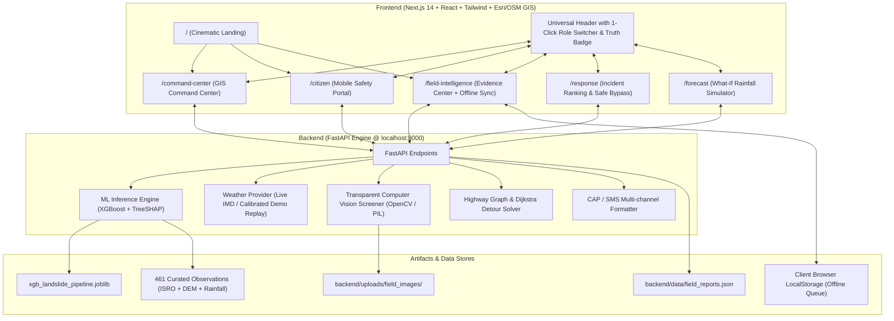

# PRAVAAH (प्रवाह) — AI Landslide Risk Intelligence & Disaster Response Platform

[](https://nextjs.org)
[](https://fastapi.tiangolo.com)
[](https://xgboost.readthedocs.io)
[](#machine-learning-architecture)
[](#verification--testing)
[](#smart-india-hackathon-2026-context)

> **"See the risk before the road disappears."**
> 
> A scientifically grounded, operational landslide intelligence and early warning platform engineered for the **North Eastern Region of India (Sikkim, Assam, Arunachal Pradesh, Mizoram)**.
> 
> Developed for **Smart India Hackathon 2026 — Problem Statement SIH260001**:  
> *"AI-Based early warning and landslide Risk Monitoring System in NER"*  
> **Ministry of Development of North Eastern Region (MDoNER)**

---

## 🧭 Multi-Page Platform Architecture

PRAVAAH provides a unified, role-aware experience tailored for administrators, field personnel, and residents alike across 6 dedicated routes:

| Route | View | Description & Primary Features | Target Role |
|---|---|---|---|
| **`/`** | **Public Landing** | Cinematic terrain aesthetic, problem breakdown, animated pipeline flow diagram, 4 capability highlights, credibility strip, and instant role selection modal. | *Public / Evaluators* |
| **`/command-center`** | **GIS Command Center** | Full-bleed GIS map with Esri Topo/Satellite/Streets, real-time risk polygons, SHAP factor breakdown drawer, live alert ticker, and scenario toolbar. | *🏛️ Disaster Management* |
| **`/citizen`** | **Citizen Safety Portal** | Mobile-first community view with automatic geolocation detection, 5-tier color status, plain-language "Why", safety checklists, and district emergency helplines. | *👥 Citizen / Traveler* |
| **`/field-intelligence`** | **Field Evidence Center** | Photo upload with transparent computer vision screening (soil colorimetry, edge discontinuity, debris score), offline `localStorage` queue, and sync indicator. | *📷 Field Officer* |
| **`/response`** | **Incident Response** | Multi-criteria incident prioritization matrix (`P1 / P2 / P3`), lifeline corridor monitoring, and Dijkstra-based safe highway detour calculation (NH-717A bypass). | *🏛️ Disaster Management* |
| **`/forecast`** | **Simulation Sandbox** | What-If rainfall surge simulator with preset buttons (`+20%`, `+40%`, `+60%`, `+100%`), continuous slider, and instant before/after sector risk comparison cards. | *🔬 Analyst / Planner* |

### 1-Click Role Switcher
Users can seamlessly pivot between perspectives at any point using the prominent **Role Switcher Dropdown** in the universal header:
- **🏛️ Disaster Management**: Navigates to `/command-center` with full operational controls.
- **📷 Field Officer**: Navigates to `/field-intelligence` for ground reconnaissance and evidence submission.
- **👥 Citizen**: Navigates to `/citizen` for localized warnings, emergency helplines, and zero-jargon guidance.

---

## 🗺️ Zero-Watermark GIS Tile Architecture

PRAVAAH features a bulletproof GIS basemap engine that requires **no proprietary API keys** and renders **zero evaluation watermarks**:

1. **Topographic (Default)**: Esri World Topo Map (`https://server.arcgisonline.com/ArcGIS/rest/services/World_Topo_Map/MapServer/tile/{z}/{y}/{x}`)
2. **Satellite Imagery**: Esri World Imagery (`https://server.arcgisonline.com/ArcGIS/rest/services/World_Imagery/MapServer/tile/{z}/{y}/{x}`)
3. **Street Map**: Esri World Street Map (`https://server.arcgisonline.com/ArcGIS/rest/services/World_Street_Map/MapServer/tile/{z}/{y}/{x}`)
4. **Resilient Fallback**: Automatic failover to OpenStreetMap tiles (`https://tile.openstreetmap.org/{z}/{x}/{y}.png`) if tile servers encounter network rate-limiting.

---

## 📶 Offline-First Field Evidence Queue

Field officers operating in mountainous gorges often lose mobile connectivity. PRAVAAH includes an offline sync engine:
- When network connectivity is absent or the FastAPI backend is unreachable, submitted photo reports are automatically serialized to browser `localStorage`.
- The interface displays an active offline counter badge: `⚠️ X offline reports queued`.
- Once reconnected, a single click on **"Sync Now"** flushes the pending queue directly to the server with zero data loss.

---

## 🏛️ System Architecture



---

## 🔬 Scientific ML Foundation

PRAVAAH is powered by verified observational data rather than synthetic distributions:

- **Observational Dataset**: 461 real spatial-temporal records across Northeast India combining verified landslide positive events (ISRO/NRSC Landslide Atlas, GSI Bhusanket) with geographically stratified non-event observations sampled during historical dry/monsoon periods.
- **Model Evaluation**: Evaluated under spatial holdout cross-validation to prevent geographic leakage:
  - **XGBoost Classifier**: `ROC-AUC = 0.933` (Selected operational model)
  - **Random Forest**: `ROC-AUC = 0.912`
  - **Logistic Regression Baseline**: `ROC-AUC = 0.841`
- **Key Predictive Drivers**:
  1. `rain_72h`: Cumulative antecedent 72-hour precipitation (pore pressure buildup)
  2. `slope`: Terrain gradient derived from 30m SRTM/Copernicus DEM
  3. `rain_24h`: Trigger downpour intensity
  4. `historical_landslide_density`: Spatial proximity to historical scarp zones

---

## 🚀 Quick Start Guide

### Prerequisites
- **Node.js**: v18.0.0 or later
- **Python**: v3.10, v3.11, or v3.13 with pip
- **Git**

### 1. Clone the Repository
```bash
git clone https://github.com/Devdeepakjha/pravaah.git
cd pravaah
```

### 2. Configure Environment
```bash
cp .env.example .env.local
```
*(Default values work out of the box with zero external API dependencies in DEMO_REPLAY mode).*

### 3. Start the ML Backend (FastAPI)
```bash
# Install Python dependencies
pip install -r backend/requirements.txt

# Launch FastAPI server on port 8000
python -m uvicorn backend.main:app --host 127.0.0.1 --port 8000 --reload
```
API Documentation is accessible at: `http://127.0.0.1:8000/docs`

### 4. Start the Frontend (Next.js)
```bash
# Install NPM packages
npm install

# Run development server on port 3000
npm run dev
```
Open `http://localhost:3000` in your web browser.

---

## 🧪 Verification & Testing

The backend includes a comprehensive test suite testing all 11 core subsystems:

```bash
pytest backend/tests/test_api.py -v
```

### Test Coverage Summary
| Test Case | Description | Result |
|---|---|:---:|
| `test_01_health_check` | API health check & model artifact verification | **PASSED** |
| `test_02_predict_single` | Single-point XGBoost ML inference & SHAP impact | **PASSED** |
| `test_03_risk_zones_endpoint` | Regional GIS risk polygons & live telemetry enrichment | **PASSED** |
| `test_04_weather_endpoints` | Weather status, current observations & district queries | **PASSED** |
| `test_05_simulation_delta` | What-If rainfall surge simulation & delta calculation | **PASSED** |
| `test_06_field_reports_and_vision_screening` | Multipart photo submission & computer vision screener | **PASSED** |
| `test_07_response_priorities_matrix` | P1/P2/P3 incident prioritization ranking | **PASSED** |
| `test_08_alerts_and_preview` | Active civil defense alerts & CAP/SMS preview | **PASSED** |
| `test_09_routing_dijkstra_detour` | Blockade avoidance & NH-717A bypass routing | **PASSED** |
| `test_10_invalid_inputs_and_errors` | Robust 404/422/400 validation error handling | **PASSED** |
| `test_11_weather_resilience_fallback` | Resilient fallback to calibrated historical replay | **PASSED** |

### Frontend Build Verification
```bash
npm run build
```
- Fully passes static generation across all 6 routes (`/`, `/command-center`, `/citizen`, `/field-intelligence`, `/response`, `/forecast`) with code 0.

---

## 🛡️ Scientific & Operational Disclaimers

1. **Probabilistic Risk Statements**: Model outputs represent calibrated statistical landslide probabilities based on historical patterns and current rainfall. They are not deterministic guarantees of immediate slope failure.
2. **Computer Vision Screening**: The field evidence photo analysis tool provides preliminary visual screening (edge discontinuity, soil colorimetry, and debris coverage) to expedite response prioritization; it is **not** a substitute for certified on-site geotechnical boreholes or certified engineering surveys.
3. **Highway Status**: Road status and detour suggestions are verified against current Border Roads Organisation (BRO) and regional police bulletins.
4. **Data Provenance**: The platform transparently displays whether incoming telemetry is sourced from live IMD stations, cached data, or calibrated historical replay scenarios.

---

## 📄 License
Released under the MIT License. Developed for disaster risk reduction and community resilience across Northeast India.
